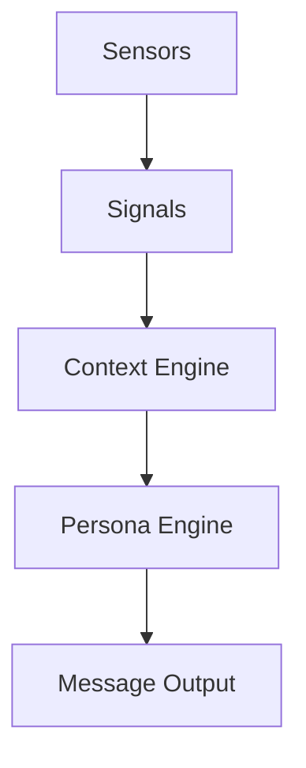

# DevCompanion

DevCompanion is a desktop character that supports your development workflow.

## Architecture

DevCompanion adopts a 5-layer event pipeline architecture to robustly detect and respond to developer activities.



1.  **Sensors**: Detect raw OS/filesystem events (Process, File, Git).
2.  **Signals**: Normalized low-level events (e.g., `SigFileModified`, `SigGitCommit`).
3.  **Context Engine**: Probabilistic state estimation (e.g., `Coding`, `DeepWork`, `Struggling`).
4.  **Persona Engine**: Determines character tone based on context and relationship.
5.  **Message Output**: Generates final speech using LLM (Ollama/Claude/Gemini).

### Reliability & Observability

*   **Signal Recorder**: Records all incoming signals to `.devcompanion/signals/*.jsonl` for debugging.
*   **Replay Engine**: Replays recorded signals to reproduce bugs or verify logic.
*   **Deterministic Mode**: LLM responses can be seeded for stable testing.

## Testing Strategy

*   **Unit Tests**: Core logic (Context, Behavior, Session) is covered (> 80%).
*   **Stability Tests**: Long-running signal replay tests to detect memory leaks and goroutine leaks.
*   **Integration Tests**: Router tests to ensure multi-layer LLM fallback works correctly.

## Development

```bash
# Run unit tests
go test ./internal/...

# Run stability test
go test ./internal/monitor -v -run TestLongRunningStability

# Debug viewer
go run cmd/contextviewer/main.go -f ~/.devcompanion/signals/latest.jsonl
```
